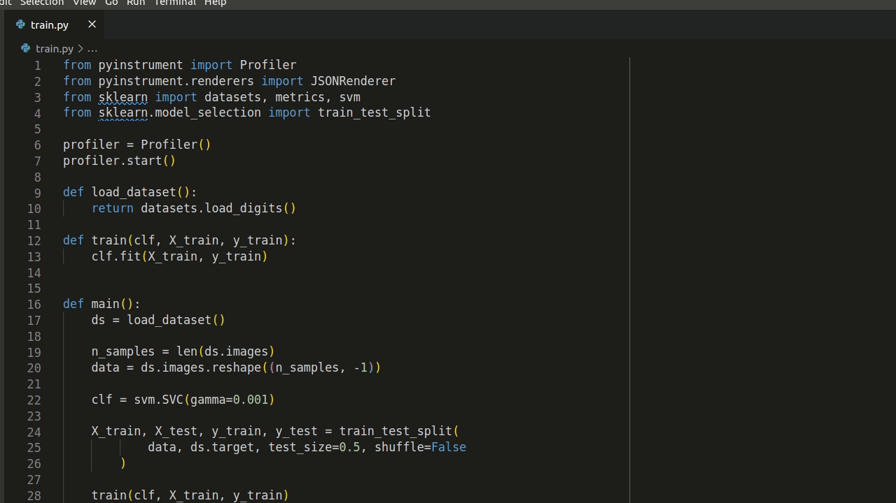
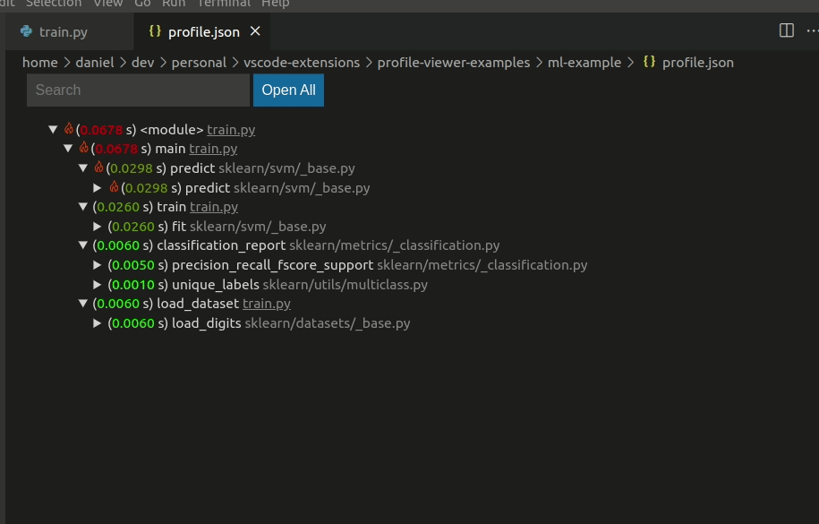
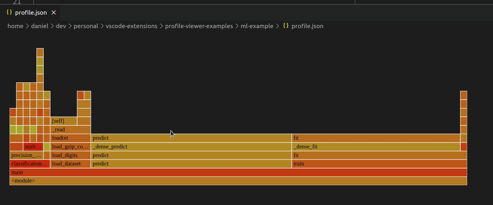

# PerfView

PerfView is an extension for viewing performance profiles directly in VSCode. 
It can open profiles from [GProf](), [PyInstrument](), [CProfile](), 
[HPCToolkit](), [Caliper](), [Tau](), [Score-P](), and [TimeMemory]().
Currently it supports a view of the call tree with run times and a flamegraph.

## Features

Open profiles using the command `Profile: Open Profile`.
You will be asked for the type of profile and path to the profile.
Then it will open in a tree and flamegraph view.

Both of the views are dynamic.
You can click around, explore the data, and even jump directly
to the corresponding source code locations.

## Requirements

PerfView uses the Python library [Hatchet]() to parse and process the different
profile types.
You must install it in order to use the extension.
Assuming there is a valid Python installation, then it can be installed with 
`pip install hatchet`.

## Extension Settings

No settings right now.

## Known Issues

### Submitting Issues

## Release Notes

### 0.0.1

Initial release. Support for [GProf](), [PyInstrument](), [CProfile](), 
[HPCToolkit](), [Caliper](), [Tau](), [Score-P](), and [TimeMemory]().

