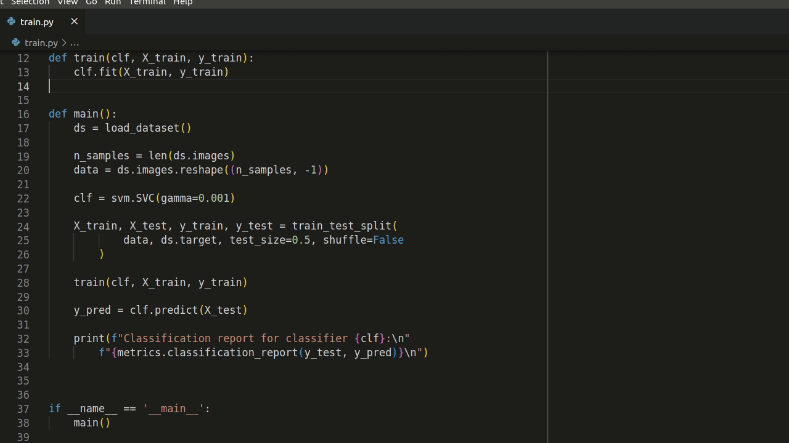
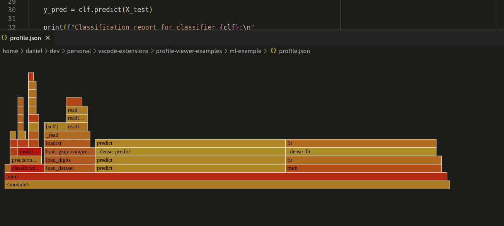

# Performance Profile Viewer

Performance Profile Viewer is an extension for viewing performance profiles 
directly in VSCode. 
It can open profiles from 
[GProf](https://ftp.gnu.org/old-gnu/Manuals/gprof-2.9.1/html_mono/gprof.html), 
[PyInstrument](https://pyinstrument.readthedocs.io/en/latest/), 
[CProfile](https://docs.python.org/3/library/profile.html#module-cProfile), 
[HPCToolkit](http://hpctoolkit.org/), 
[Caliper](https://software.llnl.gov/Caliper/), 
[Tau](http://www.cs.uoregon.edu/research/tau/home.php), 
[Score-P](https://www.vi-hps.org/projects/score-p/), 
and [Timemory](https://github.com/NERSC/timemory).
Currently, it supports a view of the call graph with run times and a flamegraph.

## Features

Open profiles using the command `Profile: Open Profile` (CTRL+SHIFT+P or 
CMD+SHIFT+P to start commands).
You will be asked for the type of profile and path to the profile.
Then it will open in a tree and flamegraph view as shown below.

Both of the views are dynamic.
You can click around, explore the data, and even jump directly
to the corresponding source code locations.

## Requirements

Performance Profile Viewer uses the Python library 
[Hatchet](https://hatchet.readthedocs.io/en/latest/) 
to parse and process the different profile types.
You must install it in order to use the extension.
Currently, the extension has only been tested with Hatchet version 1.3.1.
Assuming there is a valid Python installation, then it can be installed with 
`pip install hatchet==1.3.1`.

## Extension Settings

No settings right now.

## Known Issues

### Submitting Issues

Issues can be submitted under the [issues tab on GitHub](/issues).

## Release Notes

### 0.0.1

Initial release. 

- Support for profiles from 
[GProf](https://ftp.gnu.org/old-gnu/Manuals/gprof-2.9.1/html_mono/gprof.html), 
[PyInstrument](https://pyinstrument.readthedocs.io/en/latest/), 
[CProfile](https://docs.python.org/3/library/profile.html#module-cProfile), 
[HPCToolkit](http://hpctoolkit.org/), 
[Caliper](https://software.llnl.gov/Caliper/), 
[Tau](http://www.cs.uoregon.edu/research/tau/home.php), 
[Score-P](https://www.vi-hps.org/projects/score-p/), 
and [Timemory](https://github.com/NERSC/timemory).
- Call tree viewer
- Flamegraph viewer

