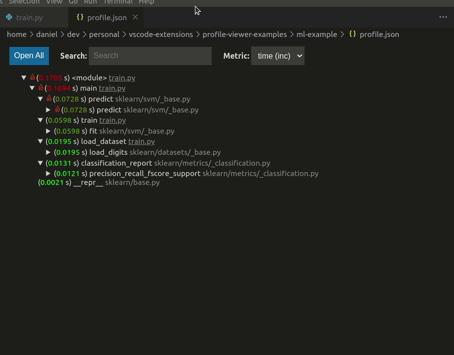

<p align="center"></p>
<h1 align="center">Performance Profile Viewer</h1>


<b>An extension for collecting and viewing performance profiles directly in VSCode.</b>

[](https://marketplace.visualstudio.com/items?itemName=danielnichols.performance-profile-viewer)&nbsp;[](https://marketplace.visualstudio.com/items?itemName=danielnichols.performance-profile-viewer)&nbsp;[](https://github.com/Dando18/performance-profile-viewer-vscode/releases)&nbsp;[](https://github.com/Dando18/performance-profile-viewer-vscode/blob/develop/LICENSE)&nbsp;[](https://github.com/Dando18/performance-profile-viewer-vscode/actions/workflows/ci.yaml)


Performance Profile Viewer is an extension for collecting and viewing
performance profiles directly in VSCode. 
It can open profiles from 
[GProf](https://ftp.gnu.org/old-gnu/Manuals/gprof-2.9.1/html_mono/gprof.html), 
[PyInstrument](https://pyinstrument.readthedocs.io/en/latest/), 
[CProfile](https://docs.python.org/3/library/profile.html#module-cProfile), 
[HPCToolkit](http://hpctoolkit.org/), 
[Caliper](https://software.llnl.gov/Caliper/), 
[Tau](http://www.cs.uoregon.edu/research/tau/home.php), 
[Score-P](https://www.vi-hps.org/projects/score-p/), 
[Timemory](https://github.com/NERSC/timemory),
and [raw JSON data](/src/test-workspaces/profiles/json/profile.json).
Currently, it supports a view of the call graph with run times and a flamegraph.
***NOTE:*** This extension requires the Python package hatchet to be installed.
See [Requirements](#requirements) for more info.

## Features

### Viewing Performance Profiles

Open profiles using the command `Profile: Open Profile` (CTRL+SHIFT+P or 
CMD+SHIFT+P to start commands).
You will be asked for the type of profile and path to the profile.
Then it will open in a tree and flamegraph view as shown below.


Both of the views are dynamic.
You can click around, explore the data, and even jump directly
to the corresponding source code locations.




### Collecting Profiling Data

Launching the different profilers for your programs is provided through VSCode 
tasks.
For instance, define tasks in your `tasks.json` similar to the PyInstrument 
example below to set up profiler launching directly in VSCode.
See the [Profiling Documentation](docs/profiling.md) for more details.

```json
{
    "type": "PyInstrument",
    "program": "main.py",
    "args": [
        "--foo"
    ],
    "outputPath": "${workspaceFolder}/profile.json"
}
```

## Requirements

Performance Profile Viewer uses the Python library 
[Hatchet](https://hatchet.readthedocs.io/en/latest/) 
to parse and process the different profile types.
You must install it in order to use the extension.
Currently, the extension has been tested with Hatchet version 1.3.1
and Python 3.7 to 3.11.
Assuming there is a valid Python installation, then it can be installed with 
`pip install hatchet==1.3.1`.

## Extension Settings

- `profileviewer.animatedHotPathIcons` [_boolean_] (default: `false`) -- animate the icons that display the hot path along the tree
- `profileviewer.pythonPath` [_string_] -- manually provide the path to the Python executable that has hatchet installed; otherwise the extension will try to find it automatically

## Known Issues

### Submitting Issues

Issues can be submitted under the [issues tab on GitHub](https://github.com/Dando18/performance-profile-viewer-vscode/issues).

## Release Notes

### 0.1.2

- add export and import
- clean up documentation

### 0.1.1

- add task definitions to run PyInstrument, cProfile, and HPCToolkit
- added [documentation for tasks](docs/profiling.md)

### 0.1.0

- separate commands for opening tree, flamegraph, and both
- added setting to manually specify Python and hatchet path
- better error checking for Python and hatchet versions in environment
- cache environment information, so it's faster to open profiles

### 0.0.5

- Hotfix for missing HTML file

### 0.0.4

- Hotfix for missing Python script

### 0.0.3

- updated logo
- fancy hot path icons
- added licensing information
- better error messages

### 0.0.2

- Added show hot path button.
- Added support to open [raw JSON data](/src/test-workspaces/profiles/json/profile.json).

### 0.0.1

Initial release. 

- Support for profiles from 
[GProf](https://ftp.gnu.org/old-gnu/Manuals/gprof-2.9.1/html_mono/gprof.html), 
[PyInstrument](https://pyinstrument.readthedocs.io/en/latest/), 
[CProfile](https://docs.python.org/3/library/profile.html#module-cProfile), 
[HPCToolkit](http://hpctoolkit.org/), 
[Caliper](https://software.llnl.gov/Caliper/), 
[Tau](http://www.cs.uoregon.edu/research/tau/home.php), 
[Score-P](https://www.vi-hps.org/projects/score-p/),
[Timemory](https://github.com/NERSC/timemory),
and raw JSON data.
- Call tree viewer
- Flamegraph viewer


# License

Copyright Daniel Nichols 2023

Performance Profile Viewer is published under the [Apache 2.0 license](/LICENSE).
The flamegraph view uses [d3-flame-graph](https://github.com/spiermar/d3-flame-graph),
which is published under the [Apache 2.0 license](https://github.com/spiermar/d3-flame-graph/blob/master/LICENSE).
[Hatchet](https://github.com/hatchet/hatchet) is published under the [MIT license](https://github.com/hatchet/hatchet/blob/develop/LICENSE).
